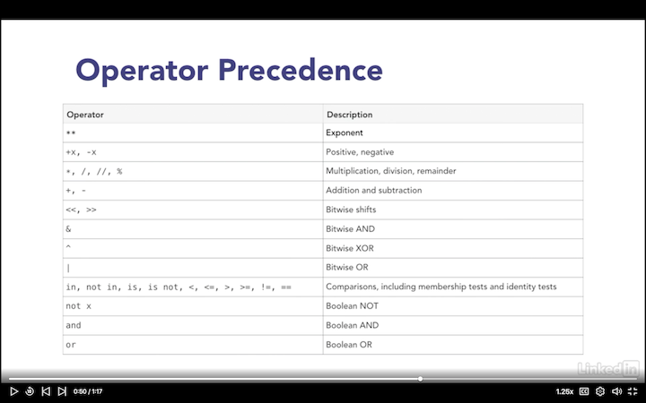

# Python Essentials

* 
* Local and Global Variables:
  * By default, the variables defined inside a function or code block is local to the block.
  * The value changes are only applicable inside the code block even if there's a variable with the same name outside the code block.
  * Anyone that tries to access the variable outside of the block will get an undefined error.
  * A global variable can be accessed anywhere, to be able to change it, the keyword ` global ` can be attached to it.
* The order of variables in a function has to be like: args, *args, **kwargs
* `for x in items` can be used to iterate over the items in a list or tuple
* `for idx,x in enumerate(items)` can be used to access the index and the items in a list or tuple.
* `for k in dict`, `for k in dict.keys()` can be used to iterate over the keys in a dictionary.
* `for k,v in dict.items()` will iterate over the keys and values in a dictionary.
* `zip(list1, list2)`  can be used to combine lists in parallel. Example below:
* isin check if the value in question is in a list of values.

```python
 indexes = [0, 1, 2, 3, 4, 5, 6, 7, 8]
colors = ["red", "green", "blue", "purple", "pink"]
ratios = [0.2, 0.3, 0.1, 0.4, 0.0]
for idx, color, ratio in zip(indexes, colors, ratios):
    print(f"{idx} {ratio * 100}% {color}")
```

* Lists, tuples and dictionaries can be combined using *args and **kwargs. Example below:

```python
tuple3 = (*tuple1, *tuple2)
list = [*list1, *list2]
dict3 = {**dict1, **dict2}
```
